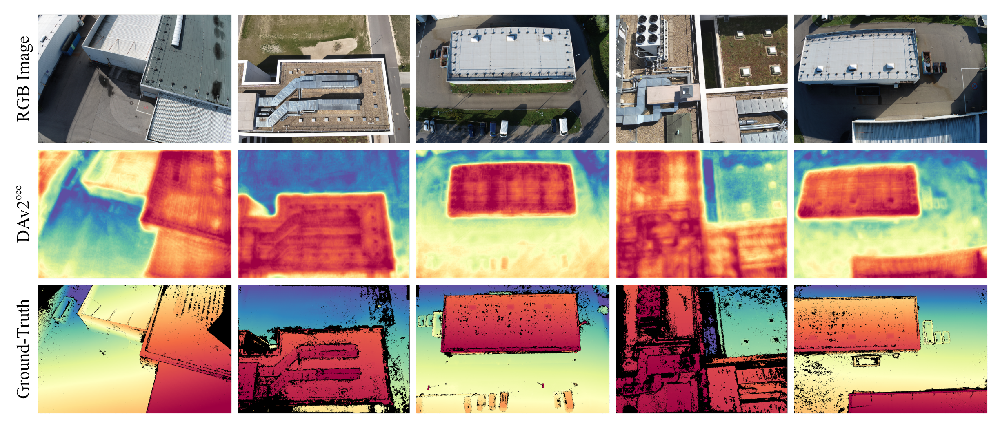

# Metric Monocular Depth Estimation for Aerial Semantic Scene Completion

> **Note:** This work was conducted as part of the aerial Semantic Scene Completion (SSC) benchmark **OccuFly (CVPR 2026 Oral)**. 
> 
> 🔗 **[OccuFly Website](https://markus-42.github.io/publications/2026/occufly/)** | 🔗 **[OccuFly GitHub](https://github.com/markus-42/occufly)** | 📄 **[Detailed Report PDF](./Monocular_Depth_Estimation.pdf)**

## 📌 Overview
Robust aerial autonomy requires environmental representations that transcend 2D image observations, capturing the underlying 3D structure of the scene. This becomes critical in the presence of occlusions, where significant portions of the environment are hidden from the sensor's current viewpoint. 

While LiDAR sensors provide high-fidelity geometric data, they are often impractical for lightweight aerial platforms due to constraints in payload, power consumption, and cost. Consequently, monocular depth estimation, the task of predicting pixel depths from a single RGB image, has emerged as a practical alternative. The resulting depth maps serve as crucial geometric priors for downstream 3D Semantic Scene Completion (SSC) tasks without the hardware overhead of active sensors.

## 🛠️ Summary of Contributions
Monocular depth estimation is an inherently ill-posed problem, and this ambiguity is further amplified in aerial scenarios due to extreme viewpoint variations, scale ambiguities, and complex scene structures. 

To address this, my specific technical contributions include:
* **Foundation Model Adaptation:** Fine-tuned Depth Anything V2 (DAv2) on the OccuFly dataset to generate high-fidelity, metric depth maps that resolve the complex spatial characteristics of aerial imagery.
* **Comparative Benchmarking:** Evaluated the fine-tuned model against a diverse set of prominent foundation models, including MapAnything V1.1, Metric3D v2, and Depth Anything 3 (DA3).
* **Transfer Learning Analysis:** Investigated synthetic-to-real knowledge transfer paradigms. Results indicate that for smaller models, direct fine-tuning on high-quality real-world data remains a more effective strategy for domain adaptation.

## 📸 Qualitative Results
The fine-tuned model captures global scene geometry and absolute scale with high consistency across the varying altitudes and perspectives of the OccuFly dataset. Below is a comparison of the RGB input, the predictions from the fine-tuned Depth Anything V2 ($DAv2^{occ}$) model, and the OccuFly ground-truth depth maps:

Ultimately, these predicted depth maps provide a reliable geometric prior, establishing a solid foundation for the subsequent semantic scene completion task.
